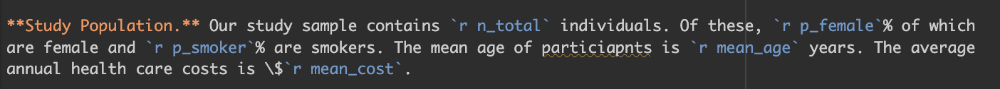

```{r, setup, include = F}
knitr::opts_chunk$set(
    comment = "", 
    fig.width = 6,
    fig.height = 4,
    dpi = 300
)
```

```{r, include = F}
#### if need to install packages, run below
# install.packages("here")
# install.packages("readr")
# install.packages("tidyverse")
# install.packages("gtsummary")
# install.packages("ggplot2")

library(here)
library(tidyverse)
library(readr)
library(gtsummary)
library(ggplot2)
library(broom)
```

# Introduction

The goal of this assignment is to "produce a reproducible document to synthesize concepts learned throughout the course, but, in particular, collaborative workflows and reproducible programming practices" (hrp/epi 203 assignment 4). Rather than focusig on a complex research question, this report will emphasize the tools and programming techniques that support good, reproducible science. Throughout the document, all tables, figures, and equations are generated directly from code rather than entered manually. This allows to us ensure that any changes made to the underlying data set (if applicable) will automatically get reflected throughout the report, without having to manually update anything.

Through this class (as well as through a bit of my own research), I've learned that creating a reproducible workflow requires quite a bit of additional effort in the beginning. However, I do strongly believe that it improves transparency, reduces errors, and makes analysis easier to update, improve upon, and share. I'm now understanding that there's a whole reproducibility world out there -- and I've only begun to scratch the surface.

To illustrate **as many principles** we've learned in this class, we will use a simulated data set stored in this repository within `raw-data/` called `cohort`, which contains 5,000 observations with variables `smoke`, `female`, `age`, `cardiac`, and `cost`. This report will focus on the relationship between `age` and `cost`, which we will interpret as annual health care costs. We hypothesize that increasing age will be associated with increased annual healthcare costs, consistent with the well-established pattern that older individuals tend to utilize more medical services and carry greater chronic disease burden [@Chen2023].

# Methods

**Inline R code.** All numerical values reported in the **Methods** and **Results** sections are generated using **inline R code**. This approach eliminates hard-coded values and ensures that reported statistics remain consistent with the data we are using. For instance, if we wanted to include the sentence, "Our study sample contains 5,000 individuals." Rather than hard-coding 5,000, we would first define the total number of individuals in our data such and then call it using inline code syntax:

```{r, eval = F}
n_total = nrow(data)
n_female = sum(data$female)
p_female = round((n_female/n_total)*100, 0)
```



Below is what it looks like rendered. 

```{r, echo = F, message = F}
data <- read_csv(here("raw-data", "cohort.csv")) |> 
        mutate(
        age_cat = case_when(
        age < 30 ~ "18-29", 
        age >= 30 & age < 50 ~ "30-49", 
        age >= 50 ~ "50+", 
        TRUE ~ NA_character_
    ), .after = age
    )

n_total = nrow(data)
n_female = sum(data$female)
p_female = round((n_female/n_total)*100, 0)
n_smoker = sum(data$smoke)
p_smoker = round((n_smoker/n_total)*100, 0)
mean_age = round(mean(data$age), 0)
mean_cost = round(mean(data$cost), 0)
```

**Study Population.** Our study sample contains `r n_total` individuals. Of these, `r p_female`% of which are female and `r p_smoker`% are smokers. The mean age of particiapnts is `r mean_age` years. The average annual health care costs is \$`r mean_cost`.

**Outcome.** The outcome of interest is annual health care `cost`, measured in US dollars (\$).

**Exposures.** The primary exposure of interest is `age`. For ease of interpretation and visualization purposes, we categorized into three groups: 18-29, 30-49, and 50+. Additional covariates include sex (`female`), smoking status (`smoke`), and history of cardiac disease (`cardiac`).

**Statistical Analysis.** We conducted decriptive statistics to understand the underlying characteristic distribution of the cohort. We used counts and percents to capture categorical variables and mean and standard deviation to assess continuous variables. To assess the relatinoship between `age` and `cost`, we fit a linear regression with `cost` as our outcome and `age` as our primary predictor, adjusting for `female`, `smoke`, and `cardiac`. We report regression coefficients with 95% confidence intervals (CI). All analyses were conducted in R. **Equation 1** shows the mathematical notation of the linear regression.

$$
Y = \beta_0 + \beta_1age + \beta_2sex + \beta_3smoke + \beta_4cardiac + \epsilon
$$ {#eq-glm}

where,

-   $Y$ = annual health care cost
-   $\beta_0$ = model intercept
-   $age$ = age group
-   $sex$ = sex
-   $smoke$ = smoking status
-   $cardiac$ = history of cardiac disease
-   $\beta_1$ - $\beta_4$ = regression coefficients
-   $\epsilon$ = random error term


```{r, echo = F,  message = F}
df_tbl <- 
    data |> 
    mutate(
        smoke = factor(smoke, 
                       levels = c(0,1), 
                       labels = c("no", "yes")), 
        female = factor(female, 
                        levels = c(0,1), 
                        labels = c("no", "yes")), 
        cardiac = factor(cardiac, 
                         levels = c(1,0), 
                         labels = c("cardiac event", "no cardiac event"))
    ) 
```

```{r, echo = F, message = F}
#| tbl-pos: "htbp"
#| tbl-cap: "Baseline Characteristics, N = 5,000"
df_tbl |> 
    tbl_summary(
        statistic = list(all_continuous() ~ "{mean} ({sd})")
    )
```

```{r, include = F, message = F}
model_unadj <- lm(cost ~ age_cat, data = data)
summary(model_unadj)

model_adj <- lm(cost ~ age_cat + female + smoke + cardiac, data = data)
summary(model_adj)
```

``` {r, echo = F, message = F}
#| tbl-pos: "htbp"
#| tbl-cap: "Association Between Age and Health Care Cost"

tbl_merge(
    tbls = list(
        tbl_regression(
            model_unadj,
            estimate_fun = ~ style_number(.x, digits = 2)
            ),
        tbl_regression(
            model_adj,
            estimate_fun = ~ style_number(.x, digits = 2)
            )
        ),
    tab_spanner = c("**Unadjusted**", "**Adjusted**")
    )
```

```{r, include = F}
model_results <- tidy(model_adj, conf.int = TRUE)
model_results

beta_age_cat30 <- model_results |>
    filter(term == "age_cat30-49") |>
    pull(estimate) |>
    round(2)

ci_age_cat30 <- model_results |>
  filter(term == "age_cat30-49") |>
  select(conf.low, conf.high) |>
  round(2)

beta_age_cat50 <- model_results |>
    filter(term == "age_cat50+") |>
    pull(estimate) |>
    round(2)

ci_age_cat50 <- model_results |>
  filter(term == "age_cat50+") |>
  select(conf.low, conf.high) |>
  round(2)

beta_female <- model_results |>
    filter(term == "female") |> 
    pull(estimate) |> 
    round(2)

ci_female <- model_results |>
  filter(term == "female") |>
  select(conf.low, conf.high) |>
  round(2)

beta_smoke <- model_results |>
    filter(term == "smoke") |> 
    pull(estimate) |> 
    round(2)

ci_smoke <- model_results |>
  filter(term == "smoke") |>
  select(conf.low, conf.high) |>
  round(2)

beta_cardiac <- model_results |>
    filter(term == "cardiac") |> 
    pull(estimate) |> 
    round(2)

ci_cardiac <- model_results |>
  filter(term == "cardiac") |>
  select(conf.low, conf.high) |>
  round(2)

r2_adj <- round(summary(model_adj)$r.squared, 3)
```

# Results

**Table 1** summarizes the baseline characteristics of the study population. The average participant age was `r mean_age` years, and the mean annual health care cost was `r mean_cost`. **Figure 1** displays the distribution of annual health care costs across age categories. The boxplots suggest that both median costs and variability in costs increase with age.

**Table 2** shows both unadjusted and adjusted regression results. After adjusting for sex, smoking status, and cardiac disease history, estimates remained largely unchanged from the unadjusted model. Participants aged 30–49 had `r beta_age_cat30` higher annual costs than the 18–29 reference group (95% CI: `r ci_age_cat30$conf.low`, `r ci_age_cat30$conf.high`; p<0.001), and those aged 50+ had `r beta_age_cat50` higher costs (95% CI: `r ci_age_cat50$conf.low`, `r ci_age_cat50$conf.high`; p<0.001), supporting our hypothesis that older age is associated with greater annual health care expenditure.

Being female was associated with `r beta_female` lower annual costs (95% CI: `r ci_female$conf.low`, `r ci_female$conf.high`; p<0.001). Smoking was associated with `r beta_smoke` higher costs (95% CI: `r ci_smoke$conf.low`, `r ci_smoke$conf.high`; p<0.001), and a history of cardiac disease was associated with `r beta_cardiac` higher costs (95% CI: `r ci_cardiac$conf.low`, `r ci_cardiac$conf.high`; p<0.001).

**Figure 2** displays the distribution of annual health care costs by age category and smoking status. Smokers had higher costs than non-smokers across all three age groups and this gap persisted as individuals got older.

**Figure Generation.** Figures 1 and 2 were generated directly in a code chunk using the `ggplot2` package. Quarto automatically reads and evaluates the chunk like any r script and generates the visualization within the document, ensuring consistency in the results. Thus, there is no need to export the plot as a .png here and then re-insert it. We show the code for Figure 1 but then use `include = F` for Figure 2 to conserve space. 

```{r, message = F}
#| fig-cap: "Box plot distributions of health care costs per year by age category"
#| fig-width: 6
#| fig-height: 4

df_tbl |> 
    ggplot() + 
    geom_boxplot(
        aes(x = age_cat, 
            y = cost, 
            color = age_cat, 
            fill = age_cat), 
        alpha = 0.2) + 
    labs(x = "Age Category (years)", 
        y = "Annual Cost (dollars)", 
        color = NULL, fill = NULL)
```

```{r, message = F, echo = F}
#| fig-cap: "violin plot distributions of annual health care costs by age category and smoking status"
#| fig-width: 6
#| fig-height: 4

df_tbl |> 
    mutate(
        smoke = recode(
            smoke, 
            "no" = "Non-smoker", 
            "yes" = "Smoker"
            )
        ) |> 
    ggplot(
        aes(
            x = age_cat, 
            y = cost, 
            color = smoke, 
            fill = smoke
            )
        ) +
    geom_violin(
        alpha = 0.2, 
        position = position_dodge(width = 0.8)
        ) +
    labs(
        x = "Age Category (years)",
        y = "Annual Cost (USD)",
        color = NULL,
        fill = NULL
        ) +
    theme(legend.position = "top")
```

# Discussion

This report demonstrates several principles of reproducible research (e.g., data processing, inline code, and automatically generated tables and figures) while also producing semi-meaningful findings. The analysis in this report is intentionally simple, as it's focus is to highlight the tools available when using reproducible documents. Nevertheless, we found that participants in older age groups had higher average costs than those in younger age groups, even after adjusting for sex, smoking status, and cardiac disease history. More sophisticated analyses and subgroup analyses should be run to understand the nuances of the age-cost relationship. 

This document is just one stop in the direction of setting up an analysis workflow that is scalable, reproducible and replicable for future sophisticated analyses. Through this class, I learned many things. Perhaps one of the most important take-aways is that reproducible reporting practices improve transparency, facilitate collaboration, and increases confidence in scientific evidence by ensuring that results can code can be replicated by other researchers. We should encourage everyone to do it! 

<br>
<br>

**AI Statement:** *I attest that I did not use generative AI technology to complete this assignment.*

# References
::: {#refs}
